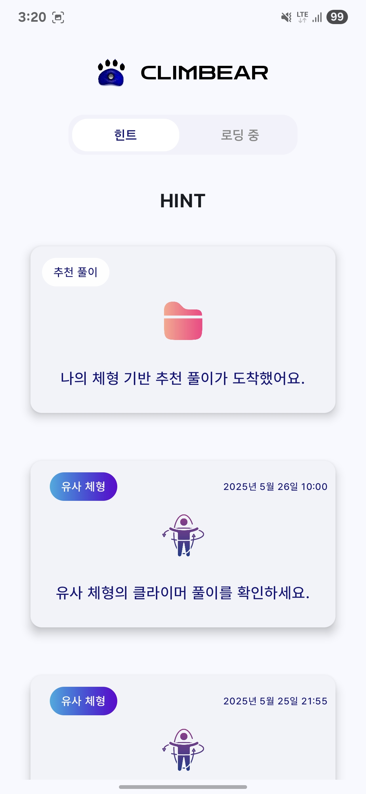

# Climbear

> **클라이밍 솔루션 앱**
> 

## 목차

---

- [📜 프로젝트 소개](#-프로젝트-소개)
- [📹 소개 영상](#-소개-영상)
- [🖼️ 기획 배경](#️-기획-배경)
- [🚩 프로젝트 목표](#-프로젝트-목표)
- [👥 팀원 소개](#-팀원-소개)
- [📅 프로젝트 진행 기간](#-프로젝트-진행-기간)
- [⚙️ 개발 환경](#️-개발-환경)
- [📊 산출물](#-산출물)
  - [ERD](#erd)
  - [애플리케이션 아키텍처](#애플리케이션-아키텍처)
  - [인프라 아키텍처](#인프라-아키텍처)
- [⚙️ 설치 방법](#️-설치-방법)
- [▶️ 기능 소개](#️-기능-소개)
  - [초기화면](#초기화면)
  - [문제 찍고 힌트 보기](#문제-찍고-힌트-보기)
  - [솔루션 확인](#솔루션-확인)
  - [유사 체형 풀이 경로](#유사-체형-풀이-경로)
  - [영상 솔루션 받기](#영상-솔루션-받기)
  - [나의 풀이 경로](#나의-풀이-경로)
  - [클라이밍 대시보드](#클라이밍-대시보드)
- [✨ 기대 효과](#-기대-효과)
- [☎️ 프로젝트 관련 문의](#️-프로젝트-관련-문의)

## **📜프로젝트 소개**

---

- 초보 클라이머들을 위한 클라이밍 솔루션 제공 앱 서비스
- 사용자는 사진 한 장으로 문제의 홀드를 분석하고 손발 순서가 포함된 솔루션을 받을 수 있습니다. 나아가 동영상으로 자신의 풀이 과정을 기록하고 관리할 수 있으며, 비슷한 체형의 다른 클라이머는 어떻게 문제를 해결했는지 확인함으로써 입체적인 성장이 가능합니다.

## 📹소개 영상

---

[12기_자율_영상포트폴리오_A306_CLIMBEAR(파일크기최적화ver).mp4](./resources/12기_자율_영상포트폴리오_A306_CLIMBEAR(파일크기최적화ver).mp4)

## 🖼️기획 배경

---

- 젊은 세대를 주축으로 스포츠클라이밍을 즐기는 인구 증가하고 있습니다.

[오늘도 벽을 탄다, 이 짜릿한 성취감 ‘터치’](https://www.khan.co.kr/article/202106111718005)

- 초중급 수준의 클라이머가 볼더링 클라이밍*을 진행 시 경로 헤매는 경우 자주 발생합니다. 그러나 각 볼더링 문제에 해당하는 풀이법을 찾기 어렵습니다. *(*이하 볼더링 클라이밍을 클라이밍으로 기재)*
    - 암장에서 자체적으로 제공하는 풀이법은 한정적입니다. (미제공 암장 다수 존재)
    - 신체적 차이 때문에, 풀이법이 클라이머마다 다를 수 있습니다.
    - 일반적으로 인스타그램에서 해시태그로 검색하여, 동일한 문제를 푼 다른 사람의 풀이 영상을 찾아 경로를 찾습니다.
- 대부분의 클라이머들은 복기나 기록을 위해 풀이 영상을 촬영합니다.
- 본 서비스는 클라이밍 시 촬영한 영상을 바탕으로 사용자의 신체적 조건(ex. 키, 몸무게, 리치)를 고려하여 풀이법을 제공합니다.

## **🚩**프로젝트 목표

---

- **개인 맞춤형 솔루션 제공:** 사용자의 신체 조건(키, 리치)에 최적화된 볼더링 문제 풀이 루트 제안합니다.
- **정보 탐색 시간 단축:** 인스타그램 등 SNS에서 해시태그로 풀이법을 검색하는 번거로움 해소합니다.
- **실력 향상 지원:** 문제 풀이 영상 로그 기록 및 다른 사람의 풀이 기록 확인을 통한 복기를 지원합니다.

## 👥팀원 소개

---

**선예지 Frontend/Android**

> 스플래시 페이지, 온보딩 페이지, 암장 관리 페이지, 홀드 선택 및 분류 페이지, 문제 등록 페이지, 로깅 페이지
카카오 소셜 로그인, 유효성 검사, 인증 및 인가 상태 관리, googleMap
> 

**황석주 Frontend/Android**

> 메인 페이지, 대시보드 페이지, 사진/비디오 촬영 페이지, 추천 경로 페이지, 유사 풀이 페이지
 Retrofit 설정, Hilt 세팅, CameraX 설정, 이미지 및 영상 처리, 권한 처리
> 

**이예진 Designer**

> 전체 UX/UI 디자인, 와이어 프레임 제작, 서비스 플로우 설계
발표 장표 제작 및 발표자
> 

**손훈서 Infra/AI**

> kubernates 클러스터, Jenkins CI, ArgoCD, AWS ECR, 로드밸런서 연결, DB(MySQL, MongoDB) 배포 및 설정
홀드 추출 및 필터링 AI 학습 및 최적화, API 개발
> 

**이가현 Backend**

> 회원 관리, 인증 및 인가, 문제 등록, 암장 관리, 풀이 등록, 솔루션 등록 API 개발
DB 설계, 데이터 삽입
> 

**이석현 Backend/AI/Android**

> 경로 탐색 알고리즘 개발
사용자 문제 풀이 로깅 기능 개발
> 

## 📅프로젝트 진행 기간

---

- 전체 개발 기간 : 2025-04-21 ~ 2025-05-23
- UI 구현 : 2025-04-28 ~ 2025-05-22
- 기능 구현 : 2025-04-24 ~ 2025-05-22
- 1차 테스트: 2025-05-05
- 2차 테스트: 2025-05-19

## ⚙️개발 환경

---

- **Android**: Kotlin, Jetpack Compose
- **Backend**: Java 17, SpringBoot 3.4.4, FastAPI
- **DB**: MySQL 8.0.40, MongoDB 8.0.0
- **Infra**: Jenkins, ArgoCD, Kubernetes
- **AI**: Yolo v11, MediaPipe Tasks SDK
- Design : [Figma](https://www.figma.com/design/GHhqrtV4QJdGoxRvwKdxwX/%EC%9E%90%EC%9C%A8A306?node-id=0-1&p=f)
- **Version Control**: [GitLab](https://lab.ssafy.com/s12-final/S12P31A306)
- **Documentation & Planning**: [Notion](https://www.notion.so/Climbear-1c0b2aa2d8ac80ce96eec870f3bcdedf?pvs=21)
- **Issue Tracking**: [Jira](https://ssafy.atlassian.net/jira/software/c/projects/S12P31A306/boards/8286)
- [커밋 컨벤션](https://www.notion.so/Git-Commit-Message-Convention-1c0b2aa2d8ac8109b9f4df0e47b5be11?pvs=21)
- [코드 컨벤션](https://www.notion.so/Code-Convention-1c0b2aa2d8ac8147accfe18118eab008?pvs=21)

## 📊산출물

---

### ERD

### 애플리케이션 아키텍처

### 인프라 아키텍처

## ⚙️**설치 방법**

---

- 배포 URL : https://drive.google.com/file/d/1Gi3np4pMC9tnV5F4Gq0M2FZ48u0Q05ZC/view?usp=sharing
- Test ID : 카카오 로그인
- Test PW : 카카오 로그인
- 상세 내용 프로젝트 포팅 메뉴얼 참고

## ▶️기능 소개

---

**[초기화면]**

- 서비스 접속 초기화면으로 splash 화면이 잠시 나온 뒤 다음 페이지가 나타납니다.
    - 로그인이 되어 있지 않은 경우 : SNS 로그인 페이지
    - 로그인이 되어 있는 경우 : Climbear 홈 화면
- 위치 정보 동의가 되어 있지 않을 경우 동의 요청이 발생합니다.

초기화면

---

---

**[문제 찍고 힌트 보기]**

- 사진 촬영을 통해 문제의 솔루션을 요청하는 화면입니다.
    - 메인 화면에서 문제 찍고 힌트 보기를 선택하여 이동합니다.
    - 홀드 인식, 홀드 분류, 시작/도착 홀드 선택, 문제 난이도, 홀드 색상, 최종 확인 순으로 진행됩니다.
    - 선택이 끝나면 문제에 대한 솔루션을 확인하는 솔루션 화면으로 이동합니다.

문제 찍고 힌트 보기

---

1. 사진 촬영
    
    
    
2. 로딩 및 홀드 인식
    
    
    
3. 암장 구멍 선택
    
    
    
4. 홀드 자동 분류
    
    
    
5. 홀드 직접 선택
    
    
    
6. start  홀드, top 홀드 선택
    
    
    
7. 홀드 색상/레벨 선택
    
    
    
8. 최종 확인 및 솔루션 검색
    
    
    
    디자인 변경 사항
    
    
    

---

**[솔루션 확인]**

- 자신이 제출한 문제에 대한 솔루션을 확인합니다.
- 갤러리 스크롤 방식을 사용하여 좌우로 드래그, 혹은 해당 구간을 클릭하여 확인할 수 있습니다.
- 사용자의 손, 발이 각각 노란색과 파란색의 반원으로 표현됩니다.

솔루션 확인

---

---

**[유사 체형 풀이 경로]**

- 자신과 유사한 체형을 가진 다른 사람의 풀이 경로를 확인합니다.
- 해당 문제에 대한 다른 사람의 풀이 경로를 리스트로 제공합니다.
- 솔루션과 유사한 형식으로 보여줍니다.

유사 체형 풀이 경로

---

---

**[영상 솔루션 받기]**

- 메인 화면에서 영상 솔루션 받기를 선택하여 이동합니다.
- 동영상 촬영 혹은 갤러리에서 불러오기를 통하여 영상을 분석합니다.
- 이후 사진 촬영과 동일한 문제 분류 화면으로 이동합니다.
- 나의 풀이 기록을 생성하여 로깅 화면으로 넘어갈 수 있습니다.

영상 솔루션 받기

---

---

**[나의 풀이 경로]**

- 영상 솔루션의 솔루션 화면에서 나의 풀이 경로를 선택하여 이동합니다.
- 나의 풀이 영상에서 내가 홀드와 접촉을 할 때의 프레임을 표시합니다.
- 내가 선택한 홀드는 흰색 테두리로 표시해줍니다.
- 시작 홀드를 선택한 시점과 탑 홀드에 도달한 시점 까지의 프레임을 보여줍니다.

나의 풀이 경로

---

---

**[클라이밍 대시보드]**

- 메인 화면에서 클라이밍 대시보드를 선택하여 이동합니다.
- 나의 문제 현황 및 나의 암장 기록을 확인할 수 있습니다.
- 나의 문제 현황에서는 현재 나의 클라이밍 등급, 문제 풀이 캘린더, 나의 신장 및 리치 정보를 확인할 수 있으며, 나의 신장 및 리치를 수정할 수 있습니다.
- 나의 암장 기록에서는 주변 암장을 지도와 리스트로 확인할 수 있으며, 암장 선택을 통해 해당 암장에서 나의 문제 풀이 기록을 확인할 수 있습니다.

---

1. 나의 문제 현황
    
    
    
2. 나의 암장 기록

    
    
    

## ✨ 기대 효과

---

1. **클라이밍 경험의 질적 향상 및 접근성 증대:**
    - **초보 클라이머의 진입 장벽 완화:** 클라이밍을 처음 시작하거나 아직 익숙하지 않은 사용자들이 느끼는 막막함을 해소하고, 필요한 정보와 가이드를 손쉽게 얻을 수 있도록 지원합니다. 이를 통해 더 많은 사람들이 스포츠 클라이밍의 즐거움을 경험하고 꾸준히 참여할 수 있도록 기여합니다.
    - **문제 해결의 즐거움 증진:** 다양한 볼더링 문제에 대한 솔루션을 직관적으로 제공받아, 클라이머들이 불필하게 헤매거나 좌절하는 시간을 줄입니다. 이를 통해 실제 등반에 더 집중하고 성공적인 완등 경험을 쌓으며 성취감을 높일 수 있습니다.
2. **개인 맞춤형 훈련을 통한 효율적인 실력 향상:**
    - **최적화된 루트 학습:** 사용자의 신체 조건(키, 리치 등)을 고려한 맞춤형 루트 제안은 비효율적인 시도를 줄이고, 자신에게 맞는 효율적인 동작과 순서를 익히는 데 도움을 줍니다.
    - **체계적인 성장 지원:** 자신의 풀이 영상을 기록하고 분석하며, 유사한 신체 조건의 다른 사용자 풀이를 참고함으로써 객관적인 자기 평가와 효과적인 복기가 가능해집니다. 이는 기술적 이해도를 높이고 실력 향상 속도를 가속화할 수 있습니다.
3. **정보 탐색의 편의성 및 효율성 극대화:**
    - **시간 및 노력 절감:** 기존에 인스타그램 등 파편화된 SNS에서 해시태태그를 통해 풀이법을 검색하던 번거로움을 해소합니다. 필요한 정보를 앱 내에서 통합적으로 빠르게 탐색할 수 있어, 클라이머는 정보 검색이 아닌 운동 자체에 더 많은 시간과 에너지를 투자할 수 있습니다.

## ☎️프로젝트 관련 문의

**SSAFY**

전화문의: 02-3429-5100

이메일 문의: [ssafy@ssafy.com](mailto:ssafy@ssafy.com)

**프로젝트 팀장**

이메일 문의: dldltjrgusrhrl@gmail.com
